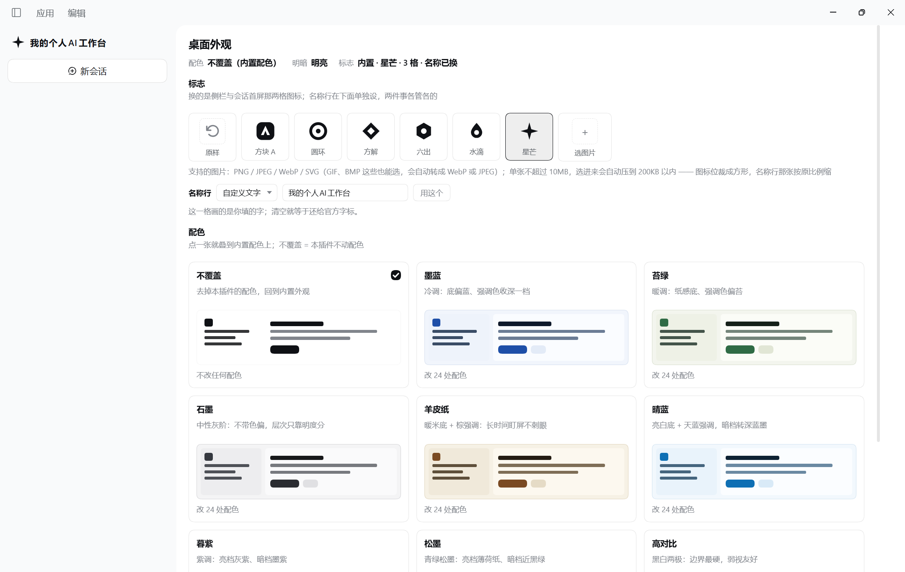

# dsh-plugin-appearance（已挂载，真机跑通）

改 **dsh 桌面版自己**长什么样：配色皮肤经宿主的 `ctx.theme` 覆盖层，侧栏与会话首屏的标志经宿主的 brand slot，选择记在宿主的 `ctx.storageDomain`。不写宿主文件、不注入全局 CSS、不碰系统设置。

## 界面实拍



读数（用户 2026-10-04 在 desktop 里截，明亮档）：页头三个 chip 分别是 `配色 不覆盖（内置配色）` / `明暗 明亮` / `标志 内置 · 星芒 · 3 格 · 名称已换` —— `3 格` 是侧栏图标、会话首屏、名称行三个 slot 全部 `ok@-1`。侧栏顶部那枚四角星和那行「我的个人AI工作台」是**挂在宿主 brand slot 里的真内容**（图标位是内置标志，名称行的文字形态由本插件自绘，见 `docs/design-spec.md` §4），不是面板里的预览。配色区九张卡（不覆盖 + 8 张皮肤）每张卡里画的是那张皮肤自己的微缩页面，脚注 `改 24 处配色` / `不改任何配色`。

**这张图没证到的**：墨蓝等皮肤真叠上去之后的界面、暗档、悬停/焦点两态的像素、名称行 1 字与 24 字的名字以及侧栏折叠成 rail 时那一格怎么排（§5-U12 要的就是这三档）、以及「来源」下拉点开态 —— 这些仍列在下面的「还欠的真机读数」里，别拿这张图当它们过了。三处例外，是**后来单独证的**（不是这张图）：① "重启后选择能不能恢复"已经证到（§5-U2）；② "名称行选图片的形态"里的**存得下 / 送得出 / 画得上**已经证到（§5-U8），但"真侧栏里会不会被裁"仍要看截图（§5-U14）；③ **「墨蓝/暮紫真叠上去之后长什么样」第九轮已用用户的两张换肤截图证到**（明亮档，见下面第九轮那条）。

（脱敏：图里抹掉了侧栏的插件列表与左下角账号行，填成侧栏底色；面板本体与品牌区一个像素没动。）

- 状态：desktop 0.2.0-rc.2 上已挂载并跑通 —— **刚进来是原样**（真机读数：`applied:0`、`spots:未抽查`、`logo:原样`），点一张皮肤才会叠层，挑一枚标志才会以 `priority -1` 占上位。
- **第四轮重做了整个面板的界面与交互**（用户原话「太丑了，页面交互不行」）：删掉 17 个同权重的黑实心按钮（改成一排可点的方片 + 整张卡可点的单选项）、状态摘要搬到页头当操作的反馈落点、补上悬停/焦点/选中三态、并修掉「在配色区点一张皮肤，面板弹回顶部」那条硬伤（根容器挂了 `key`，每次点击整棵子树连 DOM 一起重挂，而它就是滚动容器）。
- **第五轮（2026-10-04）加了两件事**：① **侧栏那行字标可以换了** —— 面板「标志」区多了个「名称行」输入框，填了就占住 `sidebar.brand.name`，留空或点「还原官方」就还给官方字标；它与两格图标位**各自独立**（只改名字不换图标、或反过来，都是合法组合，存档里也是两个字段分开判存）。② **传图不用你先自己裁** —— 原来超 200KB 直接拒，现在原图放宽到 10MB，浏览器侧自动**居中裁成方形 → 缩到 512px → 沿质量阶梯压到 200KB 以内**（有透明走 WebP 保 alpha，不透明走 JPEG，SVG 原样保留矢量不位图化），处理结果就地写在方片下面（"已裁成方形 · 从 2.4MB 压到 86KB"）。宿主那道 200KB 的闸一个字没改：压缩后送和手动换小图走同一道门。
- **同日补丁**（用户装上第五轮之后反馈的两条）：① **「点了一枚图标，再点另一枚就不生效了」是我上一轮改出来的真 bug** —— 宿主只在「注册表变化」时才重画，而我为了"改名字时图标位别闪"把它写成了纯差集，光改模块级状态宿主看不见。改成按**指纹**决定重挂（图标位指纹 = 档位\|款式\|图片地址，名称行 = 文字）：指纹变了才撤掉重占，没变就一动不动 —— 粒度刚好，换图标只重挂图标位、改名字只重挂名称行。② **方片下面那句现在把支持的格式列出来了**（PNG / JPEG / WebP / SVG，GIF、BMP 也能选），而且清单由白名单常量派生，不是手写第二遍。
- **第六轮（2026-10-04，用户两条真机反馈）**：① **「切到别的图标了，这行还挂着」** —— 方片下面那句"已裁成方形 · 从 3284KB 压到 77KB"说的是**上一张图**，切回星芒它还在。根因不是"忘了清"，而是"清的动作写在四个动作里，漏一条就漏了"；改成**从状态派生的纯函数**（那一格现在画的就是这张图才显示），四条路径自动都盖得住。② **名称行那一格也支持图片了** —— 那一格现在有**两张脸**（文字 / 图片），口径是**图片优先、文字留着**：有图画图，但文字一个字节不删，点「清掉图片」就回到你原来填的那段字（而不是空白）。存储上两格各占一行（`logo` 表的 `mark` / `name`），另有一个 0/1 开关管"这张图算不算数" —— 「清掉图片」重启后也得真的回到文字。
- **第七轮（2026-10-04，用户「名称行改成下拉，不同选项对应不同操作」）**：名称行那四个平铺的入口（输入框 / 用这个 / 还原官方 / 选图片）收成**一个「来源」下拉** —— 官方字标 / 自定义文字 / 自定义图片。**画什么由这个来源决定，不是"谁非空就画谁"**：反推的写法表达不出"选了图片但还没选到图"这种中间态，用户一选就被弹回上一项（真 bug，`ap-52` 抓的）。切来源**不毁数据**（切到文字/图片时另一份内容一个字节不碰，只有「官方字标」和「清掉图片」真清）；落盘把来源投影成已有的 `prefs.brandNameImage` 那个 0/1（`image` ⇒ true），所以**存档格式一个字没改、旧档照读**。选了「自定义图片」而手里还没图时，那一格**降级画文字、连文字也没有就还给官方**（不留空白），并就地写一句"还没选图片"。**选来源不会顺手弹文件框** —— 弹不弹只由用户点「选图片」那一下决定（用户装上后补的一条）。
- **同日再补（用户真机报的第三条）**：「名称行选了图片，退出再打开还是文字」。真 bug，在**宿主这一侧**：`lib/api.js` 的 `readPrefs()` 往页面报初始选择时，`brand` 里只带了 `mode` / `markId` / `name`，**漏了 `nameImage` 那一个 0/1** —— 而页面恢复"那一格用的是哪个来源"唯一认的就是它（`client.js` 的 `bootBrand`）。表现就是用户看到的这样：图**在库里**（`nameLogoUrl` 照报），来源却掉回「自定义文字」，那一格于是画文字。修法是补那一个字段，并让 `hs-28` 钉住它（改之前该用例先红了一次，读数在下面）。**为什么离线 98 条用例没抓到**：`ap-*` 那批是手搓 `runtime.boot` 喂给页面的，喂的是"我以为宿主会给的形状"（带 `nameImage`），而宿主半边 `hs-*` 那批从没断言过这个字段 —— 桩比宿主多给了一个字段，正是本仓库铁律盯的那件事。图标位那张图不受影响（它的启用状态由 `brandMode=image` 表达，那条一直带着）。
- **第八轮（2026-10-05，用户真机截图）**：换肤之后正文里的**行内代码变成一块实心深蓝、字几乎看不见**。根因不是"颜色没挑好"，是**把令牌的用途猜错了** —— `--dsw-alias-markdown-inline-code` 读起来像"行内代码的**字色**"，实际它是那一小块的**底色**（宿主 CSS：`.markdown code{background-color:var(--dsw-alias-markdown-inline-code)}`，字色是从上下文继承来的）。我按名字猜成字色、8 张皮肤全填成"亮档深、暗档浅" ⇒ 亮档深底压深字、暗档浅底压浅字，两头都糊成一块（真机量出来 `ink` 亮档只有 **1.60:1**）。**修法不是重挑颜色，是按用途重定语义**：既然它是底，就从一条已知正确的东西（`bg-base`）推 —— 取底色的 HSL、饱和降到 ≤30%、亮档 L−7 / 暗档 L+6，逐张皮肤与自家色相贴齐；对比度全部 12:1 以上。判定用途的办法不是读名字，是去**运行中的 asar 里看这个令牌被哪个 CSS 属性用了**（`tmp/token-audit.mjs`，一次审计 24 个令牌）。新增的 `sk-12` 钉的不是某个色值，而是**"这个令牌的形态必须是底"**（对正文色 ≥4.5:1 + 与 `bg-base` 拉得开 + 亮档更沉暗档更亮），三个子条件各配一条变异（M68/M69/M70）。**这条同时立了一条新铁律**：令牌按用途填、不许按名字猜（见下「铁律」）。
- **第九轮（2026-10-05，真机验证）**：用户**完全退出 dsh 重启**后点了「墨蓝」→「暮紫」两张皮肤，给了两张截图 —— **皮肤链第一次在真机上真的走通了**。宿主探针（只读）回报 `applied:24`、`spots:bg-base:ok label-primary:ok brand-primary:ok`、`skinId:"plum"`，且回报时刻比宿主启动晚约 9 分钟 ⇒ 是本次会话产生的；存档 `prefs.skinId` 也从 `none` 变成了 `plum`，写入时刻与回报只差 2ms。**据此销掉两条**：① **U1b 结案** —— 24 个令牌不是"送出去了"而是真被界面读到了（截图里底色/正文/链接/边框/滚动条逐项命中皮肤表）；② **U16 结案** —— 第八轮修的行内代码在真机上确实好了。像素取证（`tmp/png-diff.mjs`）：用户报 bug 那张截图里旧值 `#1B3D6B` 有 **93630 像素**的深蓝方块，修好后同一张皮肤 **0 像素**、新值 `#DDE2ED` **53126 像素**；芯片三处逐一核对 = 底 `markdown-inline-code` / 字 `label-primary`（继承）/ 描边 `border-l1`，正文压在芯片底上 **13.43:1**。U3 与 U11 各推进半格（重复 apply 后仍是 24、无上一张残留；面板页头那行数字这次没截进来）。**暗档仍未验。**
- **第十轮（2026-10-05，用户「开始优化体验」）**：一口气做了四件低风险的事。① **拖拽 / 粘贴换图** —— 图标位那格与名称行那格现在都能**把图直接拖进去**，或**先点一下那格再 Ctrl+V 粘贴**（两个入口最后都走原来那条上传通道，裁切/压缩口径一个字没变）。三个必须做对的关节：`dragover` 一定 `preventDefault`（不拦浏览器压根不派 `drop`，还会把文件当成"打开它"）、`dragleave` 用 `relatedTarget` 判是不是真离开（那格里有子元素，不判就是一路闪）、粘贴**不做全局监听**（`document` 上挂一个会把整个应用里每次粘贴都抢走，用户往输入框里粘文字也被当成选图）。高亮长在那一格自己身上，不用浮层提示条。② **一键「全部还原为官方」**（页头右上）—— 之前要在三处分别还原（配色拉回「不覆盖」、标志点「原样」、名称行下拉选「官方字标」），"哪一处还没还原干净"正是最容易漏的。落盘上有两处必须一起做对：三个"用户动过"开关**全都要举起来**（宿主的写是整份覆盖，少举一个它就把清空漏掉，重启后名字或图又回来了），以及配色与 brand 分成两条最小 patch。已经全官方时按钮**变灰而不是消失**（藏起来用户永远不知道有这条路）；判据取状态、不取"点没点过"，所以从存档恢复出来的皮肤也算数。图片字节**不删**，只把那个 0/1 开关关掉（和「清掉图片」同一条口径）。③ **页头反馈加 `aria-live`** —— 摘要那行是"成了没有"的唯一落点，但它对读屏用户是隐形的；现在摘要带 `aria-live="polite" aria-atomic="true"`、红字条那块是 `role="status"`。新增的那个还原按钮**放在摘要盒子外面**，不然每次换肤读屏都会把按钮名再念一遍。④ **配色卡脚注露 WCAG 对比度读数**（`改 24 处配色 · 正文对比 15.9:1`）—— 好看不好看一眼就有，读得清不清得算。`contrastRatio()` 是纯函数（无副作用 ⇒ 能离线断言），算不出来（「不覆盖」没有自己的令牌 / 值不是 `#RRGGBB`）就**不画这一项，不编一个数**；低于 4.5 时挂红字（读 `--dsw-alias-state-error-primary`），八张现在都过，那条支路留着是为了以后加皮肤时它当场红。**零存储改动**（没加字段、没加行、`SCHEMA_VER` 仍是 1）。
- 第四~十轮的**用例与变异证据仍是离线**（103 条用例 / 79 条变异 + 离线出图读数，出图工具未入库，见下面「跑验证」那段的说明；读数本身抄在 `docs/design-spec.md` §6）；真机这边有下面那张截图、用户报回来的四条反馈，以及第九轮的两张换肤截图。回报字段里没有版本标志，所以**读 `GET /api/state` 也证明不了页面吃没吃新 client bundle** —— 要看这版界面，请**完全退出 dsh 再启动**（`Ctrl+R` 够不够没验过）。
- 还欠的真机读数：~~最要紧的一条 —— 真机上从没点过皮肤~~ **第九轮已验，U1b/U16 结案**。仍欠：**暗档没验过**（第九轮两张截图都是明亮档，`scheme:light`）；**面板本体没截进来**，所以页头那行 `配色 N 处`（§5-U11 的界面半）、悬停/焦点两态（§5-U10）、抽查三行在真机上长什么样都没看过；`overrideTokens` 同 source 重复叠加到底是"原位替换还是挪到栈顶"要**另一个插件**盖同一令牌才分得出来（§5-U3，本插件是唯一 source）；默认态那一格里的"官方原 logo"也验不了（你已经换成了自己的图，§5-U1c）。名称行**填文字**在真侧栏里有一张图（见上「界面实拍」），但它只覆盖 **9 字 + 展开态**，1 字 / 24 字与折叠 rail 三档仍未量、只填名字不换图标时两格互不牵连那条时序判据也没在真机走过（§5-U12/U13）；名称行**那张图**在真侧栏里会不会被裁、以及"切回星芒之后那行绿字真的消失"这条回归（§5-U14）；**来源下拉**的收起态在上图里，**点开态**（三项列表）与"点一枚标志下拉不许跳回官方字标"这条回归仍未测（§5-U15）。
- **2026-10-05 复读过一次（GET-only），销掉三条**：① 三个 brand slot 全部 `ok@-1`（侧栏图标 / 会话首屏 / 名称行，负 priority 真机接受）；② **重启确实从存档恢复** —— 存档写入时刻早于宿主本次启动，而当前会话报的正是存档那份，连"名称行用的是图片"这个来源都一起回来了（§5-U2）；③ 图片走同源路由 `` 在真机可用（两张都是 `200 image/webp` + `nosniff`，512×512 与 512×88，远在 200KB 闸内），没被 CSP 挡（§5-U8）。原始读数照抄在 `docs/design-spec.md` §5 之后那段。
- 设计与证据、真机读数（一、二轮）与离线像素读数（三～七轮）：`docs/design-spec.md`（每条结论都注了出处，未决项在 §5）

## 能做到 / 做不到

| | |
|---|---|
| ✅ | 8 张内置皮肤 × 明暗两档（每张 24 个 `--dsw-alias-*`，另有「不覆盖」—— **排在配色区第一位、进来默认选中的就是它**）；侧栏图标位与会话首屏图标位：**内置六枚里挑** 或 **选本地图片**（PNG / JPEG / WebP / SVG，GIF、BMP 等也能进；原图 ≤10MB，自动裁方 + 压到 ≤200KB）；**侧栏那行名称字标也能换**（来源下拉选「官方字标 / 自定义文字 / 自定义图片」—— 选文字就填字、选图片就传图，**选图片还没图时降级画你填的文字**；切来源不毁另一份内容，两样都空即还原官方）；挑过的选择存进宿主存档（重启能不能恢复待真机验，见上）；面板内容超高时**自己滚**，同一行的卡片等高、脚注齐平，配色卡片带该皮肤自己的预览**与 WCAG 正文对比度读数**；两处上传口**支持拖拽与 Ctrl+V 粘贴**（和"点一下选文件"走同一条通道）；页头有**一键「全部还原为官方」**（配色/标志/名称行一次归位） |
| ❌ | 桌面壁纸、背景图、字体（资源送达通道未定）；窗口标题栏那个名字（构建期常量 `DSH_CLIENT_TITLE`）；exe 与托盘图标（安装目录里的文件，改了会被自动更新还原） |
| 🎨 界面 | **页头 = 标题 + 一行摘要**（配色 / 明暗 / 标志）+ 右侧**「全部还原为官方」**，点一下或出错都在这一行就地反映，不用翻到页尾（摘要与红字条都是 `aria-live` 区，读屏用户同样接得住）；分两区（标志在前、配色在后）。**标志**是一排 76px 可点方片（原样 + 六枚内置 + 一格"选图片"，那格是 `<label>` 包着隐藏的 file input，整格点哪儿都开选择器，**也可以把图直接拖到格上或先点一下那格再 Ctrl+V**，拖拽中那格自己高亮），方片下面另有一行**「名称行」**（一个**来源下拉**：官方字标 / 自定义文字 / 自定义图片 —— 选文字出「输入框 + 用这个」，选图片出「选图片/换一张图 + 缩略图 + 清掉图片」，**一次只出现一组操作**，不用在图里数按钮；那一格同为拖拽/粘贴落点；图在的时候就地写一句"这一格现在画的是上面那张图"，选图片还没图时写"还没选图片 —— 现在画的是你填的文字"，免得你以为内容改坏了），**配色**是整张卡可点的单选项：选中态长在卡自己身上（主题色描边 + 角标），卡里**不再嵌按钮**（一个选择只有一个入口），卡脚注写「改 24 处配色 · 正文对比 15.9:1」（对比度低于 AA 时那个数字转红）。三态齐：`:hover` 换底色、`:focus-visible` 有焦点环、`.ap-on` 跟皮肤走；`role="radio"` + `aria-checked`，方向键在组内移动并当场选中。每张配色卡里画一个该皮肤自己的微缩页面（侧栏条 + 正文两行 + 按钮条），明暗档跟着切。面板在宿主那一格里自己滚动（配方抄官方入口页的 `height:100% + overflow:auto`，不用 `100vh` —— Windows 上标题栏那条 `padding-top` 会把尾巴顶出屏幕） |

内置「设置 → 通用 → 外观」那行仍只有 明亮 / 暗黑 / 跟随系统 —— 本插件的层**叠在它上面**，两档跟着一起切，不跟它抢。每张皮肤只覆盖 24 个令牌，真令牌共 117 个，其余 93 个露出内置配色（界面上就地写明，不假装整站换肤）。

## 目录

```
index.js              宿主半边：/appearance 路由 + 把皮肤/标志表推给页面 + 开存档 domain
client.js             浏览器半边：皮肤层 + 两格图标位与名称行的按需注册/撤销 + 图片自动裁切压缩 + 「桌面外观」面板 + 存档读写
                      界面三块：Head（标题 + 状态摘要 + 就地报错）/ LogoSection（标志方片 + 名称行）/ 配色单选项网格 + StatusCard + Disclosure
lib/skins.js          皮肤表（唯一出处，8 张）
lib/marks.js          内置标志六枚的清单 + 名称行字数上限（跨边界常量）
lib/schema.js         自造的最小 schema 校验器（宿主实现零 instanceof 才敢这么接）
lib/store.js          选择存档：domain appearance_prefs，两张表 prefs / logo（prefs 里 skinId / brandMode / brandMarkId / brandName / brandNameImage 各自可选；logo 表两行 mark=图标位那张、name=名称行那张）
lib/api.js            路由表、载荷键名、回报字段白名单、图片这道门的重新验
docs/screenshots/     真机截图（当前一张：desktop 0.2.0-rc.2 · 明亮档 · 默认配色，已抹掉侧栏插件列表与账号行）
test/                 103 条离线用例 + 带出处的桩 + 两份夹具（host-tokens.txt 名字基线 117 真令牌 / host-token-values.json 内置实际值，只给出图通道用）+ api-shape.mjs（真机 GET-only 复核）
```

## 跑验证

```bash
npm test                     # = node test/run-all.mjs：期望 skins 13 / plugin 31 / client 59 = 103，全 0 挂
node test/api-shape.mjs      # 真机复核（dsh 得在跑；只 GET，不写任何东西）
```

**这一仓库里没有的那部分开发工具**：变异电池（79 条）、离线出图与滚动/齐平度量、面板文案逐条打印、对比度读数、令牌用途审计、两张截图的像素比对/颜色普查、以及对运行中 asar 的一次性取证脚本 —— 它们连同产物（截图、日志）都留在作者本机的 `tmp/`，**没有入库**，所以 `docs/design-spec.md` §5/§6 里那些读数**在这份仓库里复跑不出来**。唯一入库的真机复核入口是 `test/api-shape.mjs`（只读 GET）。要复现其余读数只有两条路：照 §2/§6 写下的判据自己重建工具，或直接读 `test/` 那 103 条用例（它们才是这些结论现在唯一带得走的机器断言）。这是取舍，不是遗漏：那些脚本里有一堆指向作者机器路径的一次性代码，公开出去对别人没用。

## 安装

### 方式 A：官方 CLI（web profile）

```bash
dsh plugin --profile web add github:gh-gongjin/dsh-plugin-appearance
```

CLI 内部走 pnpm，需要 `pnpm` 在 PATH 里。本地目录同样可装：`dsh plugin --profile web add <本仓库的绝对路径>`。

### 方式 B：desktop 插件面板

在 desktop 的插件面板里指到本目录即可（app 自己跑 pnpm 建 `link:` 并写 profile）。面板那两个输入框的占位符就是官方口径的两种来源（asar 原文）：`install.spec === "https://github.com/author/dsh-plugin"` 配 `installGitTemplateHint`，`install.spec === "/Users/name/my-plugin"` 配 `installPathTemplateHint: "请替换为本机插件目录的实际路径"` —— 本插件走的是后一条。命令行 `dsh plugin --profile desktop …` 被官方挡了：`profile "desktop" is managed exclusively by the Electron application`。手工改 profile 的形状见 `cordis.yml` 的注释；改前备份 `package.json`。

## 铁律

宿主半边零 `@deepseek-ai/*` import、零第三方依赖、不弹浮层、降级必须留痕且写在界面上；用户图片只走 ``（SVG 里那段脚本就不会跑），**处理前后都由宿主重新验一遍**（压缩在我们这侧做，但门在宿主那边：压缩结果仍要过一次 200KB + 类型白名单）；**默认什么都不改** —— 一切配色、标志与名称的变动都得用户点出来；桩不许比宿主能多也不许比宿主少。界面颜色的口径：一律读 `var(--dsw-alias-*)`，**唯一例外**是配色卡片里那个预览框（它的任务就是显示皮肤自己的颜色，ap-30 钉着）。**令牌按「用途」填，不许按名字猜它是前景还是背景** —— 判定用途的唯一办法是去运行中的 asar 里看它被哪个 CSS 属性用了（`tmp/token-audit.mjs`）；反例实锤：`--dsw-alias-markdown-inline-code` 名字像字色、实际是**行内代码的底色**，2026-10-05 按名字猜成字色填 ⇒ 换肤后行内代码糊成一块（用户截图报的，§5-U16）。**样式只有 `.ap-` 前缀**，根容器不许用容器查询（`container-type` 会把整页塌成一列竖线），断点一律 `@media`。布局判据不许靠猜：滚动、齐平这些先从运行中的 asar 抽官方规则再定（`docs/design-spec.md` §2 末段）。**自动处理不许变成"用户不知情地改了东西"**：裁了什么、压了多少，必须就地写出来（ap-38 咬 note 里得有"已裁成方形"和"压到"），而且**这句话该不该显示必须从当前状态派生**，不许在四个动作里各记得清一次（那样一定会漏，用户 2026-10-04 报的就是漏出来的那个）。名称行那一格**由用户选的「来源」决定画什么**（下拉三项：官方字标 / 自定义文字 / 自定义图片），**不是"谁非空就画谁"** —— 反推的写法表达不出"选了图片但还没选到图"这种中间态；切来源**不许毁数据**（另一份内容一个字节不碰，只有「官方字标」与「清掉图片」真清），落盘只投影成 `prefs.brandNameImage` 那一个 0/1（`image` ⇒ true，存档格式零改动）。ap-45/ap-45b/ap-52 咬这三条。细节见 §7。

